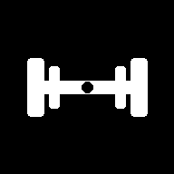
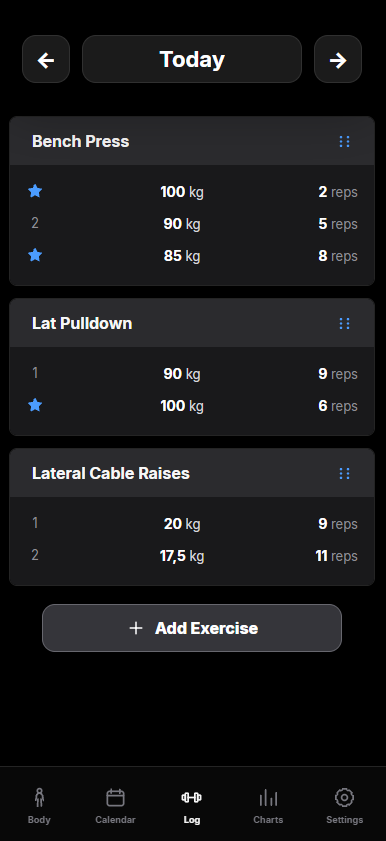
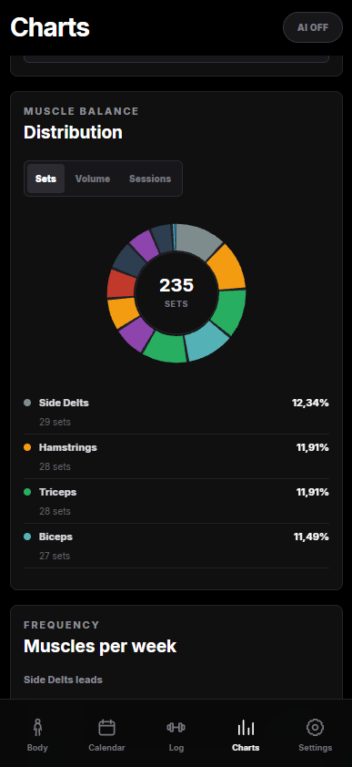

  

<h1 align="center">FitNotesViewer</h1>

  <a href="https://fitnotesviewer.pages.dev">fitnotesviewer.pages.dev</a>

  A free and open-source alternative to FitNotes, built for people who want a simple workout tracker with more ways to understand their progress.

FitNotesViewer is an alternative for FitNotes users on iOS and an interesting choice for Android users who enjoy its straightforward approach. Existing users can bring their training history with them by importing a `.fitnotes` backup or `.csv` export.

## Familiar simplicity, improved

The interface keeps the simplicity of the other FitNotes versions while adding a cleaner view of your training and body data.

  
  

  Workout logging · Training charts

- **Body** — track body weight and other measurements over time.
- **Calendar** — quickly find every day with a recorded workout.
- **Log** — add, edit, copy and organise exercises and sets.
- **Charts** — explore progress, training volume and muscle distribution.

## Your data, your choice

Import data from FitNotes on iOS or Android and export it again as a `.fitnotes` or `.csv` file whenever you need it. Your information stays on your device, allowing the app to continue working without an internet connection.

FitNotesViewer is an independent project and is not affiliated with FitNotes.

---

  Want to know how it works? Read the <a href="DETAILS.md">technical details</a>.

